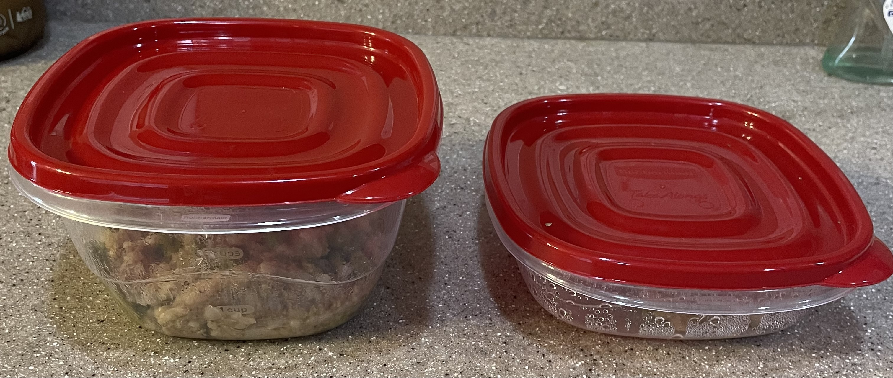
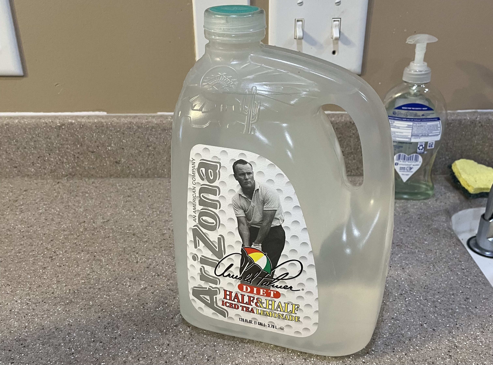

# Dog Care


---

## Food

Neil (right) and Finn (left) eat twice daily; once in the morning and once in the afternoon/evening.

Their food is individually packaged into containers for each meal which are stored in the fridge.

Neil eats the food in 1 small container for each meal and Finn eats the food in 1 large container for each meal.



Please put their food in ther food dish prior to feeding and then place the container in the sink (rinse it if you would like).

Neil eats out of the small, stainless steel bowl and Finn eats out of the purple, maze dish.


*Important*: I make Finn sit and wait to be given the command "Eat!" before he eats.

---

## Water

The dogs share water bowls which can be found in the kitchen.


They usually drink the right bowl first and the left bowl only if the right bowl is empty.

Please refill the water bowls with the reverse osmosis water in the jugs in the fridge.



---

## Walks

Neil and Finn typically get 1 walk per day. On weekends they walk and play fetch.

If you decide to walk Neil and Finn, please try to give them an hour or 2 for their food to properly digest if walking them after eating.

Their leashes are on the table in the kitchen. 


Neil always walks on the right and Finn always walks on the left.


We typically walk to [Foothills Elementary School](https://foothills.jordandistrict.org/) and back.

---

## Emergencies

If there is an emergency or if there are any issues please contact me directly.

If I am unavailable, please contact the [veterinarian](https://www.banfield.com/locations/veterinarians/ut/west-jordan/jlg).

Phone:
```
801-280-6260
```

Address:
```
Banfield Pet Hospital of West Jordan
7712 S 5600 West
West Jordan, UT 84081
```

---

[Home](https://github.com/aaronengland/20230506_banff/tree/main)
